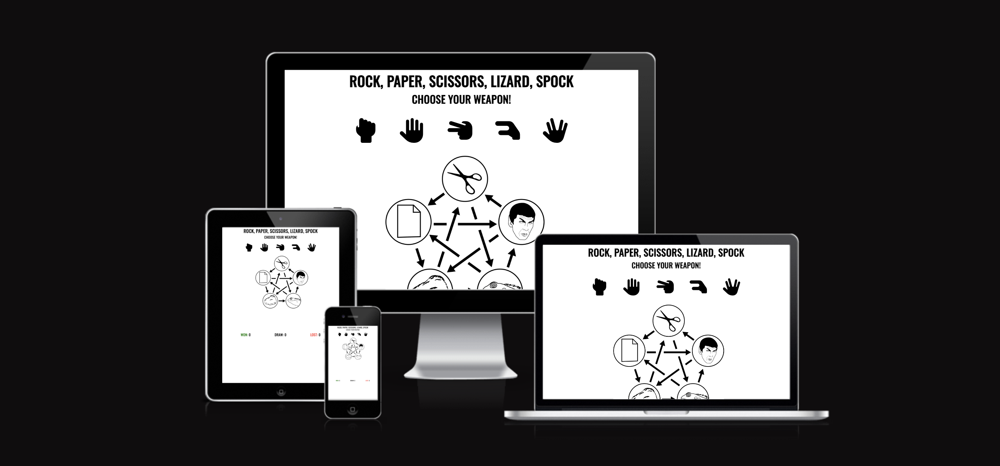
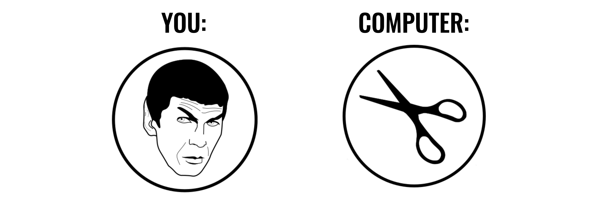
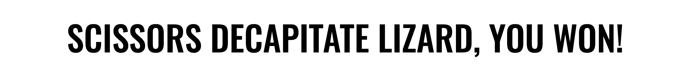
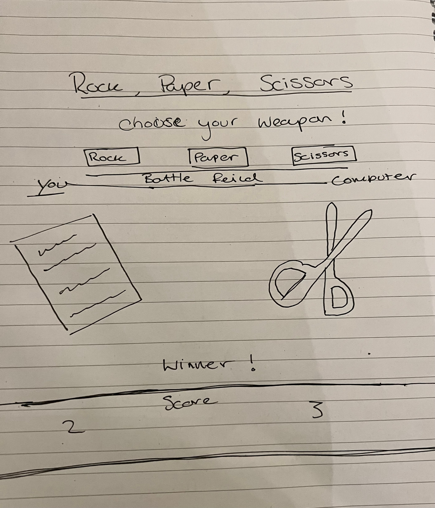
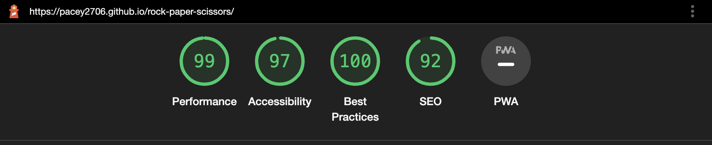
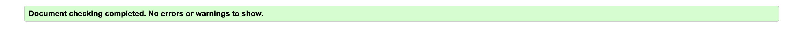
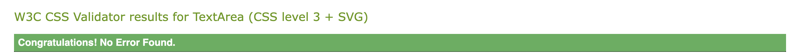

# ROCK, PAPER, SCISSORS, LIZARD, SPOCK

Rock, Paper, Scissors, Lizard, Spock is a website containing a game from the beloved show "The Big Bang Theory".
The site is aimed towards fans of the show and people who would would like to play a more complex game of Rock, Paper, Scissors. In the game your opponent is a fully automated computer who picks one of the options at random.

## Design Decisions 
The two main colours used for the site are Black and white for a clear contrast, and a clean, crisp layout, that is easily viewable by users with diminished visibility or accessibility challenges.
Green and Red font colours have been used for a win and lose score tally.
The images used are simple and perfectly represent the choices made by the user and computer.

## Features 
* Page Title
  * The page title is simple and allows the user to know exactly what the site consits of.

* Player Choice Area
  * The user is left to chose one of the five options (rock, paper, ect).
  * The text used 'choose your weapon' lets the user know this is a clickable option.

* Player and Computer Choice Display
  * In this area two images are displayed which correspond to the user choice and computer choice

* Result Message
  * The result message will appear when one of the options have been clicked.
  * The message will explain the result of the match and tell the user if they have won the match or lost.

* Score Record
  * The scores of the game are tracked with a win, lost, and draw counter.

### Future Features
* Player verses Player game option.
* More choices to expand on possible outcomes.
* Difficulty options

## Stages of Project
* The first stage of the project started as hand drawn digram.

* The project was origanlly intended to be a rock paper sicissors game
* As the project progressed more game choices were added and visuals improved

## technology
* HTML5
* CSS3
* JavaScript

## testing and validation
* Tests have have been trialed on all media sizes and all interactive elements behave appropriately.
* Light House testing

* HTML
  * No errors or warmings were returned when passing through the [official W3C validator](https://validator.w3.org/nu/?doc=https%3A%2F%2Fcode-institute-org.github.io%2Flove-maths%2F)

* CSS
  * No errors were found when passing through the [official (Jigsaw) validator](https://jigsaw.w3.org/css-validator/validator)

* JavaScript
  * No errors were found when passing through the [official Jshint validator](https://jshint.com/)
    * The following metrics were returned:
      * There are 6 functions in this file.
      * Function with the largest signature take 2 arguments, while the median is 0.
      * Largest function has 43 statements in it, while the median is 1.5.
      * The most complex function has a cyclomatic complexity value of 42 while the median is 1.
    * 15 warnings returned:
      * 'let' is available in ES6 (use 'esversion: 6') or Mozilla JS extensions (use moz). x 11
      * 'for of' is available in ES6 (use 'esversion: 6') or Mozilla JS extensions (use moz).
      * Functions declared within loops referencing an outer scoped variable may lead to confusing semantics. (startGame)
      * 'template literal syntax' is only available in ES6 (use 'esversion: 6'). x 2 

## deployment
* In the github repository navigate to the settings tab
* on the left hand side click on pages
* change the branch from 'none' to 'main' and press save
* allow the page to load the save result
* the page link will be displayed at the top of the page
* click the visit site button
* the live link can be found here - https://pacey2706.github.io/rock-paper-scissors/

## credits
* Content and Media 
  * fonts used from [google fonts](https://fonts.google.com/)
  * image used from [wikimedia commons](https://commons.wikimedia.org/wiki/File:Rock_paper_scissors_lizard_spock.svg)
  
### acknowledgement 
* original project inspiration from code insitute [PP2 project scope video](https://learn.codeinstitute.net/courses/course-v1:CodeInstitute+JSE_PAGPPF+2021_Q2/courseware/30137de05cd847d1a6b6d2c7338c4655/c3bd296fe9d643af86e76e830e1470dd/)
* Youtube video inspiration
  * [Traversy Media](https://www.youtube.com/watch?v=WR_pWXJZiRY&t=2131s)
  * [SimonDev](https://www.youtube.com/watch?v=AR2BOp_mfRU&t=177s)
  * [Knowledge Base](https://www.youtube.com/watch?v=Ny4mQywFqC8)
* Mentor 
  * [Naoise Olof Seán Gaffney](https://github.com/NaoiseGaffney?tab=repositories)

